# 🏥 Pharmacy Management System - RESTful API

A comprehensive Spring Boot RESTful API for managing pharmacy operations including user authentication, product management, prescription handling, order processing, payments, and analytics.

## 📋 Features

### Core Features
- **User Authentication & Authorization** (JWT-based)
- **Product & Inventory Management**
- **Prescription Upload & Approval System**
- **Order Management**
- **Payment Processing** (Mock Integration)
- **Notifications System**
- **Reviews & Ratings**
- **Support Ticket System**
- **Analytics & Reports**
- **Search & Filtering**

### Security
- JWT-based authentication
- Role-based access control (ADMIN, PHARMACIST, CUSTOMER)
- Password encryption with BCrypt
- Stateless session management

## 🚀 Getting Started

### Prerequisites
- Java 17 or higher
- Maven 3.6+
- Any IDE (IntelliJ IDEA, Eclipse, VS Code)

### Installation

1. Clone the repository
```bash
git clone <repository-url>
cd pharmacy-api
```

2. Build the project
```bash
mvn clean install
```

3. Run the application
```bash
mvn spring-boot:run
```

The application will start on `http://localhost:8080/pharmacy-api`

### Default Users

The application comes with pre-configured users:

| Email | Password | Role |
|-------|----------|------|
| admin@pharmacy.com | admin123 | ADMIN |
| pharmacist@pharmacy.com | pharma123 | PHARMACIST |
| customer@example.com | customer123 | CUSTOMER |

## 📚 API Documentation

### Base URL
```
http://localhost:8080/pharmacy-api/api
```

### Authentication Endpoints

#### Register User
```http
POST /auth/register
Content-Type: application/json

{
  "email": "user@example.com",
  "password": "password123",
  "fullName": "John Doe",
  "phone": "1234567890",
  "address": "123 Main St"
}
```

#### Login
```http
POST /auth/login
Content-Type: application/json

{
  "email": "user@example.com",
  "password": "password123"
}

Response:
{
  "success": true,
  "message": "Login successful",
  "data": {
    "token": "eyJhbGciOiJIUzUxMiJ9...",
    "type": "Bearer",
    "id": 1,
    "email": "user@example.com",
    "fullName": "John Doe",
    "role": "CUSTOMER"
  }
}
```

#### Get Profile
```http
GET /auth/profile
Authorization: Bearer <token>
```

#### Update Profile
```http
PUT /auth/update
Authorization: Bearer <token>
Content-Type: application/json

{
  "fullName": "John Updated",
  "phone": "9876543210",
  "address": "456 New St",
  "currentPassword": "password123",
  "newPassword": "newpassword123"
}
```

### Product Endpoints

#### Get All Products
```http
GET /products
```

#### Get Product by ID
```http
GET /products/{id}
```

#### Create Product (Admin Only)
```http
POST /products
Authorization: Bearer <admin-token>
Content-Type: application/json

{
  "name": "Medicine Name",
  "description": "Description",
  "price": 10.99,
  "category": "Pain Relief",
  "brand": "BrandName",
  "imageUrl": "https://example.com/image.jpg",
  "prescriptionRequired": false,
  "stockQuantity": 100,
  "reorderLevel": 20
}
```

#### Update Product (Admin Only)
```http
PUT /products/{id}
Authorization: Bearer <admin-token>
```

#### Delete Product (Admin Only)
```http
DELETE /products/{id}
Authorization: Bearer <admin-token>
```

#### Search Products
```http
GET /search?query=paracetamol
GET /search?filter=prescription_required
```

#### Get Stock Levels
```http
GET /inventory/stock-levels
Authorization: Bearer <token>
```

#### Update Stock
```http
POST /inventory/update-stock
Authorization: Bearer <admin-token>
Content-Type: application/json

{
  "productId": 1,
  "quantity": 50,
  "operation": "ADD"
}
```

### Prescription Endpoints

#### Upload Prescription
```http
POST /prescriptions/upload?userId=1&fileName=prescription.pdf&fileType=pdf&doctorName=Dr.Smith&notes=Notes
Authorization: Bearer <token>
```

#### Get User Prescriptions
```http
GET /prescriptions/{userId}
Authorization: Bearer <token>
```

#### Approve Prescription (Pharmacist/Admin Only)
```http
PUT /prescriptions/{id}/approve
Authorization: Bearer <pharmacist-token>
```

#### Reject Prescription (Pharmacist/Admin Only)
```http
PUT /prescriptions/{id}/reject
Authorization: Bearer <pharmacist-token>
Content-Type: application/json

{
  "reason": "Invalid or expired prescription"
}
```

### Order Endpoints

#### Create Order
```http
POST /orders
Authorization: Bearer <token>
Content-Type: application/json

{
  "userId": 1,
  "items": [
    {
      "productId": 1,
      "quantity": 2
    }
  ],
  "shippingAddress": "123 Main St",
  "paymentMethod": "Credit Card",
  "prescriptionId": 1
}
```

#### Get User Orders
```http
GET /orders/{userId}
Authorization: Bearer <token>
```

#### Get All Orders (Admin/Pharmacist)
```http
GET /orders
Authorization: Bearer <admin-token>
```

#### Update Order Status
```http
PUT /orders/{id}/status
Authorization: Bearer <admin-token>
Content-Type: application/json

{
  "status": "CONFIRMED"
}
```

#### Cancel Order
```http
DELETE /orders/{id}
Authorization: Bearer <token>
```

### Payment Endpoints

#### Initiate Payment
```http
POST /payments/initiate
Authorization: Bearer <token>
Content-Type: application/json

{
  "orderId": 1,
  "paymentMethod": "Credit Card",
  "amount": 50.99
}
```

#### Verify Payment
```http
POST /payments/verify
Authorization: Bearer <token>
Content-Type: application/json

{
  "paymentId": 1,
  "transactionId": "TXN-12345"
}
```

#### Get Payment History
```http
GET /payments/history?userId=1
Authorization: Bearer <token>
```

### Notification Endpoints

#### Get User Notifications
```http
GET /notifications/{userId}
Authorization: Bearer <token>
```

#### Get Unread Notifications
```http
GET /notifications/{userId}/unread
Authorization: Bearer <token>
```

#### Mark as Read
```http
PUT /notifications/{id}/read
Authorization: Bearer <token>
```

### Review Endpoints

#### Submit Review
```http
POST /reviews
Authorization: Bearer <token>
Content-Type: application/json

{
  "productId": 1,
  "rating": 5,
  "comment": "Great product!"
}
```

#### Get Product Reviews
```http
GET /reviews/{productId}
```

### Support Endpoints

#### Create Support Ticket
```http
POST /support/ticket
Authorization: Bearer <token>
Content-Type: application/json

{
  "subject": "Issue with order",
  "description": "Detailed description",
  "priority": "HIGH"
}
```

#### Get Ticket
```http
GET /support/ticket/{id}
Authorization: Bearer <token>
```

#### Chat with Pharmacist
```http
POST /chat
Authorization: Bearer <token>
Content-Type: application/json

{
  "message": "I need help with my prescription"
}
```

### Analytics Endpoints (Admin/Pharmacist Only)

#### Sales Report
```http
GET /reports/sales
Authorization: Bearer <admin-token>
```

#### Inventory Report
```http
GET /reports/inventory
Authorization: Bearer <admin-token>
```

#### Users Report
```http
GET /reports/users
Authorization: Bearer <admin-token>
```

## 🗄️ Database

The application uses H2 in-memory database for development.

### H2 Console Access
```
URL: http://localhost:8080/pharmacy-api/h2-console
JDBC URL: jdbc:h2:mem:pharmacydb
Username: sa
Password: (leave empty)
```

## 📁 Project Structure

```
src/main/java/com/pharmacy/api/
├── model/              # Entity classes
├── repository/         # JPA repositories
├── service/           # Business logic
├── controller/        # REST controllers
├── dto/              # Data transfer objects
├── security/         # Security configuration
├── config/           # Application configuration
└── exception/        # Exception handlers

src/main/resources/
└── application.properties
```

## 🔧 Configuration

Key configurations in `application.properties`:

```properties
# Server
server.port=8080
server.servlet.context-path=/pharmacy-api

# Database
spring.datasource.url=jdbc:h2:mem:pharmacydb

# JWT
jwt.secret=MySecretKeyForJWTTokenGenerationPharmacyAPI2024
jwt.expiration=86400000

# File Upload
spring.servlet.multipart.max-file-size=10MB
```

## 🧪 Testing

Run tests with:
```bash
mvn test
```

## 📝 Response Format

All API responses follow this format:

```json
{
  "success": true,
  "message": "Operation successful",
  "data": { }
}
```

Error responses:
```json
{
  "success": false,
  "message": "Error message",
  "data": null
}
```

## 🔐 Security Notes

- JWT tokens expire after 24 hours
- Passwords are encrypted using BCrypt
- Role-based access control is enforced
- CORS is enabled for all origins (configure for production)

## 🚀 Deployment

For production deployment:

1. Update `application.properties` with production database
2. Change JWT secret to a secure random string
3. Configure CORS for specific origins
4. Enable HTTPS
5. Set appropriate file upload limits

## 📄 License

This project is licensed under the MIT License.

## 👥 Support

For issues and questions:
- Create an issue in the repository
- Contact: support@pharmacy.com

---

# 📍 Pharmacy API - Artifacts Location Guide

## 🗂️ All Created Artifacts

I've created **9 separate artifacts** containing all the code for your pharmacy API. Here's where to find each component:

---

### **Artifact 1: pom.xml**
📦 **Artifact ID:** `pharmacy_pom_xml`
- Maven configuration file
- All dependencies (Spring Boot, Security, JWT, H2, Lombok, etc.)
- Build configuration

**Location in project:** `pharmacy-api/pom.xml` (root)

---

### **Artifact 2: application.properties**
⚙️ **Artifact ID:** `pharmacy_application_properties`
- Server configuration (port 8080)
- Database configuration (H2)
- JWT settings
- File upload limits
- Logging configuration

**Location in project:** `pharmacy-api/src/main/resources/application.properties`

---

### **Artifact 3: Main Application & Models**
🏗️ **Artifact ID:** `pharmacy_complete_project`
Contains:
- `PharmacyApiApplication.java` (Main class)
- **All 10 Model/Entity classes:**
    - User.java
    - Product.java
    - Prescription.java
    - Order.java
    - OrderItem.java
    - Payment.java
    - Review.java
    - Notification.java
    - SupportTicket.java
- **All 14 DTO classes:**
    - RegisterRequest, LoginRequest, AuthResponse
    - UpdateProfileRequest
    - ProductRequest, StockUpdateRequest
    - OrderRequest, OrderItemRequest, OrderStatusRequest
    - PaymentRequest, PaymentVerificationRequest
    - ReviewRequest
    - SupportTicketRequest
    - ApiResponse

**Location in project:**
- `src/main/java/com/pharmacy/api/PharmacyApiApplication.java`
- `src/main/java/com/pharmacy/api/model/`
- `src/main/java/com/pharmacy/api/dto/`

---

### **Artifact 4: Repositories & Services (Part 1)**
💾 **Artifact ID:** `pharmacy_api_part2`
Contains:
- **All 9 Repository interfaces:**
    - UserRepository
    - ProductRepository
    - PrescriptionRepository
    - OrderRepository
    - OrderItemRepository
    - PaymentRepository
    - ReviewRepository
    - NotificationRepository
    - SupportTicketRepository
- **Service classes (partial):**
    - AuthService
    - ProductService
    - PrescriptionService
    - OrderService (partial)

**Location in project:**
- `src/main/java/com/pharmacy/api/repository/`
- `src/main/java/com/pharmacy/api/service/`

---

### **Artifact 5: Additional Services**
🔧 **Artifact ID:** `pharmacy_api_part3`
Contains:
- **Remaining Service classes:**
    - PaymentService
    - NotificationService
    - ReviewService
    - SupportService
    - AnalyticsService

**Location in project:** `src/main/java/com/pharmacy/api/service/`

---

### **Artifact 6: Security Configuration**
🔒 **Artifact ID:** `pharmacy_api_security`
Contains:
- **Security classes:**
    - JwtTokenProvider
    - JwtAuthenticationFilter
    - CustomUserDetailsService
- **Config classes:**
    - SecurityConfig
    - CorsConfig
- **Exception handling:**
    - GlobalExceptionHandler

**Location in project:**
- `src/main/java/com/pharmacy/api/security/`
- `src/main/java/com/pharmacy/api/config/`
- `src/main/java/com/pharmacy/api/exception/`

---

### **Artifact 7: All Controllers**
🎮 **Artifact ID:** `pharmacy_api_controllers`
Contains all 10 controller classes:
- AuthController
- ProductController
- PrescriptionController
- OrderController
- PaymentController
- NotificationController
- ReviewController
- SupportController
- ChatController
- AnalyticsController

**Location in project:** `src/main/java/com/pharmacy/api/controller/`

---

### **Artifact 8: Data Initialization & README**
🌱 **Artifact ID:** `pharmacy_api_init`
Contains:
- DataInitializer.java (creates sample data)
- Complete README.md with full API documentation

**Location in project:**
- `src/main/java/com/pharmacy/api/config/DataInitializer.java`
- `README.md` (root)

---

### **Artifact 9: Complete Project Structure**
📁 **Artifact ID:** `pharmacy_project_structure`
- Detailed file structure diagram
- Complete class inventory
- Verification checklist
- API endpoint coverage

**This is documentation only** - not source code

---

## 🚀 How to Set Up Your Project

### Step 1: Create Project Structure
```bash
mkdir -p pharmacy-api/src/main/java/com/pharmacy/api
mkdir -p pharmacy-api/src/main/resources
mkdir -p pharmacy-api/src/test/java/com/pharmacy/api
```

### Step 2: Create Package Directories
```bash
cd pharmacy-api/src/main/java/com/pharmacy/api
mkdir model repository service controller dto security config exception
```

### Step 3: Copy Files from Artifacts

**Root directory files:**
1. Copy `pom.xml` from Artifact 1
2. Copy `README.md` from Artifact 8

**src/main/resources:**
3. Copy `application.properties` from Artifact 2

**src/main/java/com/pharmacy/api:**
4. Copy `PharmacyApiApplication.java` from Artifact 3

**model/ directory:**
5. Copy all entity classes from Artifact 3

**dto/ directory:**
6. Copy all DTO classes from Artifact 3

**repository/ directory:**
7. Copy all repository interfaces from Artifact 4

**service/ directory:**
8. Copy service classes from Artifacts 4 & 5

**controller/ directory:**
9. Copy all controller classes from Artifact 7

**security/ directory:**
10. Copy security classes from Artifact 6

**config/ directory:**
11. Copy config classes from Artifacts 6 & 8

**exception/ directory:**
12. Copy GlobalExceptionHandler from Artifact 6

### Step 4: Build and Run
```bash
cd pharmacy-api
mvn clean install
mvn spring-boot:run
```

---

## 📊 Quick Reference Table

| Component | Artifact ID | File Count | Location |
|-----------|-------------|------------|----------|
| Build Config | pharmacy_pom_xml | 1 | Root |
| App Config | pharmacy_application_properties | 1 | resources/ |
| Main + Models | pharmacy_complete_project | 25 | api/, model/, dto/ |
| Repositories | pharmacy_api_part2 | 9 | repository/ |
| Services 1-4 | pharmacy_api_part2 | 4 | service/ |
| Services 5-9 | pharmacy_api_part3 | 5 | service/ |
| Security | pharmacy_api_security | 6 | security/, config/, exception/ |
| Controllers | pharmacy_api_controllers | 10 | controller/ |
| Data Init | pharmacy_api_init | 2 | config/, root |
| Documentation | pharmacy_project_structure | 1 | Reference only |

**Total: 64 files across 9 artifacts**

---

## ✅ Verification Checklist

After setting up, verify you have:

- [ ] `pom.xml` in root
- [ ] `application.properties` in src/main/resources
- [ ] `PharmacyApiApplication.java` in src/main/java/com/pharmacy/api
- [ ] 10 files in model/ directory
- [ ] 14 files in dto/ directory
- [ ] 9 files in repository/ directory
- [ ] 9 files in service/ directory
- [ ] 10 files in controller/ directory
- [ ] 3 files in security/ directory
- [ ] 3 files in config/ directory
- [ ] 1 file in exception/ directory
- [ ] README.md in root

**Total: 73 files (including pom.xml, properties, README)**

---


```mermaid
   graph TD
    Start([🏁 Start]) --> UserReg[👤 User Registration]
    
    UserReg --> Login[🔐 Login & Get JWT Token]
    Login --> Dashboard{User Role?}
    
    Dashboard -->|Customer| CustomerFlow[👨‍💼 Customer Dashboard]
    Dashboard -->|Pharmacist| PharmacistFlow[💊 Pharmacist Dashboard]
    Dashboard -->|Admin| AdminFlow[⚙️ Admin Dashboard]
    
    %% Customer Flow
    CustomerFlow --> BrowseProducts[🔍 Browse Products]
    BrowseProducts --> SearchFilter[🔎 Search & Filter Medicines]
    SearchFilter --> ViewProduct[📋 View Product Details]
    ViewProduct --> CheckReview[⭐ Check Reviews & Ratings]
    
    CheckReview --> PrescCheck{Prescription<br/>Required?}
    PrescCheck -->|Yes| UploadPresc[📤 Upload Prescription]
    PrescCheck -->|No| AddCart[🛒 Add to Cart]
    
    UploadPresc --> WaitApproval[⏳ Wait for Approval]
    WaitApproval --> CheckStatus[📱 Check Notification]
    CheckStatus --> PrescApproved{Approved?}
    
    PrescApproved -->|Yes| AddCart
    PrescApproved -->|No| ContactSupport[💬 Contact Support]
    
    AddCart --> CreateOrder[📦 Create Order]
    CreateOrder --> StockCheck{Stock<br/>Available?}
    
    StockCheck -->|No| OutOfStock[❌ Out of Stock Notification]
    StockCheck -->|Yes| InitPayment[💳 Initiate Payment]
    
    InitPayment --> PaymentGateway[🏦 Payment Gateway Mock]
    PaymentGateway --> VerifyPayment[✅ Verify Payment]
    VerifyPayment --> PaymentSuccess{Payment<br/>Success?}
    
    PaymentSuccess -->|No| PaymentFailed[❌ Payment Failed]
    PaymentFailed --> RetryPayment{Retry?}
    RetryPayment -->|Yes| InitPayment
    RetryPayment -->|No| CancelOrder[🚫 Cancel Order]
    
    PaymentSuccess -->|Yes| OrderConfirmed[✅ Order Confirmed]
    OrderConfirmed --> UpdateStock[📊 Update Inventory]
    UpdateStock --> OrderNotif[📧 Order Confirmation Email]
    
    OrderNotif --> TrackOrder[📍 Track Order Status]
    TrackOrder --> OrderStatus{Order Status}
    
    OrderStatus -->|Processing| WaitShip[⏳ Wait for Shipment]
    OrderStatus -->|Shipped| InTransit[🚚 In Transit]
    OrderStatus -->|Delivered| OrderComplete[✅ Order Delivered]
    
    OrderComplete --> LeaveReview[⭐ Leave Review & Rating]
    LeaveReview --> ViewHistory[📜 View Order History]
    
    ContactSupport --> CreateTicket[🎫 Create Support Ticket]
    CreateTicket --> ChatBot[🤖 Chat with Pharmacist]
    ChatBot --> TicketResolved[✅ Issue Resolved]
    
    %% Pharmacist Flow
    PharmacistFlow --> ViewPrescriptions[📋 View Pending Prescriptions]
    ViewPrescriptions --> ReviewPresc[🔍 Review Prescription]
    ReviewPresc --> ValidatePresc{Valid<br/>Prescription?}
    
    ValidatePresc -->|Yes| ApprovePresc[✅ Approve Prescription]
    ValidatePresc -->|No| RejectPresc[❌ Reject with Reason]
    
    ApprovePresc --> NotifyCustomer1[📧 Notify Customer]
    RejectPresc --> NotifyCustomer1
    
    NotifyCustomer1 --> ViewOrders[📦 View All Orders]
    ViewOrders --> UpdateOrderStatus[📝 Update Order Status]
    UpdateOrderStatus --> ViewTickets[🎫 View Support Tickets]
    ViewTickets --> RespondTicket[💬 Respond to Tickets]
    RespondTicket --> ViewReports1[📊 View Reports]
    
    %% Admin Flow
    AdminFlow --> ManageProducts[🏥 Manage Products]
    ManageProducts --> AddProduct[➕ Add New Product]
    ManageProducts --> UpdateProduct[✏️ Update Product]
    ManageProducts --> DeleteProduct[🗑️ Delete Product]
    
    AddProduct --> ManageInventory[📦 Manage Inventory]
    UpdateProduct --> ManageInventory
    DeleteProduct --> ManageInventory
    
    ManageInventory --> CheckStockLevels[📊 Check Stock Levels]
    CheckStockLevels --> LowStock{Low Stock<br/>Alert?}
    
    LowStock -->|Yes| ReorderAlert[🔔 Reorder Alert]
    LowStock -->|No| UpdateStockQty[➕➖ Update Stock Quantity]
    
    ReorderAlert --> UpdateStockQty
    UpdateStockQty --> ViewAllOrders[📦 View All Orders]
    
    ViewAllOrders --> ManageOrderStatus[📝 Manage Order Statuses]
    ManageOrderStatus --> ViewPayments[💰 View Payment History]
    ViewPayments --> ViewAnalytics[📈 View Analytics & Reports]
    
    ViewAnalytics --> SalesReport[💵 Sales Report]
    ViewAnalytics --> InventoryReport[📦 Inventory Report]
    ViewAnalytics --> UsersReport[👥 Users Report]
    
    SalesReport --> ManageUsers[👤 Manage Users]
    InventoryReport --> ManageUsers
    UsersReport --> ManageUsers
    
    ManageUsers --> AssignRoles[🎭 Assign Roles]
    AssignRoles --> ViewReports1
    
    ViewReports1 --> End([🏁 End])
    ViewHistory --> End
    TicketResolved --> End
    CancelOrder --> End
    OutOfStock --> End
    
    style Start fill:#4CAF50,stroke:#333,stroke-width:4px,color:#fff
    style End fill:#F44336,stroke:#333,stroke-width:4px,color:#fff
    style Login fill:#2196F3,stroke:#333,stroke-width:2px,color:#fff
    style OrderConfirmed fill:#4CAF50,stroke:#333,stroke-width:2px,color:#fff
    style PaymentFailed fill:#F44336,stroke:#333,stroke-width:2px,color:#fff
    style ApprovePresc fill:#4CAF50,stroke:#333,stroke-width:2px,color:#fff
    style RejectPresc fill:#F44336,stroke:#333,stroke-width:2px,color:#fff
    style CustomerFlow fill:#E3F2FD,stroke:#2196F3,stroke-width:2px
    style PharmacistFlow fill:#F3E5F5,stroke:#9C27B0,stroke-width:2px
    style AdminFlow fill:#FFF3E0,stroke:#FF9800,stroke-width:2px
```

## 🆘 Need Help?
https://www.linkedin.com/in/shady-ahmed97/

Made with ❤️ using Spring Boot